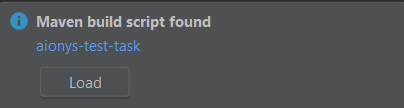
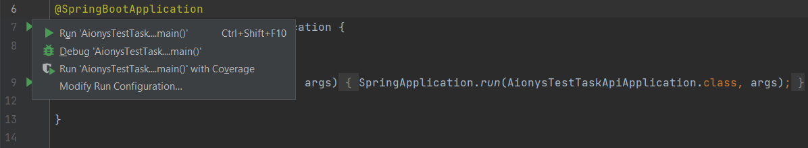
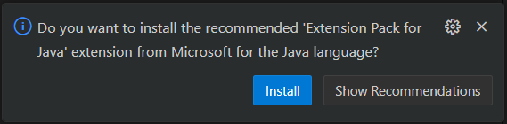
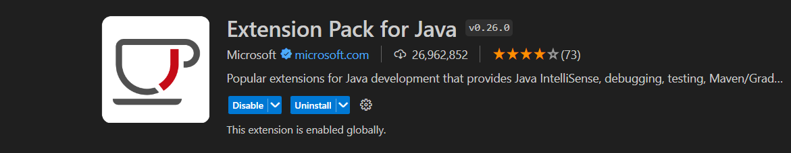
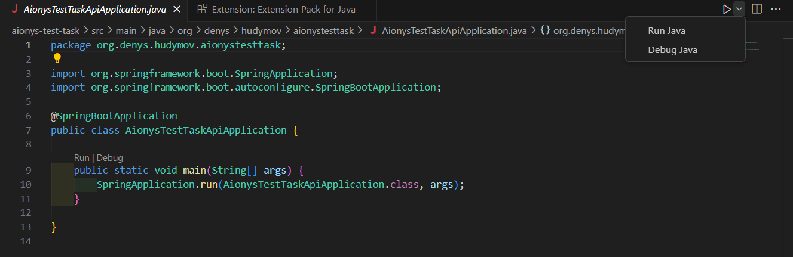

# AionysTestTask
### URL if needed to install java, maven or node with npm:
Install Node.js and NPM: https://phoenixnap.com/kb/install-node-js-npm-on-windows

how install java 21: https://www.theserverside.com/blog/Coffee-Talk-Java-News-Stories-and-Opinions/How-to-install-Java-21

How to Install Maven: https://phoenixnap.com/kb/install-maven-windows

## Instructions how to run fronted
In the cloned directory write:
1) cd frontend-aionys-test-task
2) npm install 
3) ng serve

### if you want to run e2e test 
First, run the backend and then write in the terminal(also in the frontend-aionys-test-task directory):

npm run cypress:run

## Instructions how to run API service
After doing one of the options back-end will be started and if you want to check work
of endpoints you can navigate to http://localhost:8080/swagger-ui/index.html

First option is to run it via a bat file.
1) after cloning project just double click "Run Backend" file
2) if terminal will not maybe you should update or install java jdk

Second option is to run it through IntelliJ IDEA
1) open folder that cloned from the GitHub(folder name AionysTestTask)
2) then press load button on pop up notification

3) then navigate to file AionysTestTaskApiApplication that located in AionysTestTask\aionys-test-task\src\main\java\org\denys\hudymov\aionystesttask\AionysTestTaskApiApplication.java
4) and press one of the start arrows and select 1 option 

Third option is to run it through visual studio code
1) open folder that cloned from the GitHub(folder name AionysTestTask)
2) then if such message appear press Install

 

or find this extension manually and download it

3) then navigate to file AionysTestTaskApiApplication that located in AionysTestTask\aionys-test-task\src\main\java\org\denys\hudymov\aionystesttask\AionysTestTaskApiApplication.java
and press "Run Java" on the left corner

